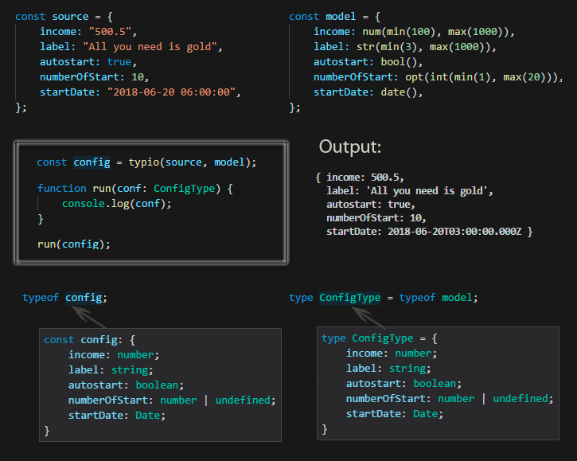

# typio

Util for casting any object to specified model with typescript type inference

[![NPM version][npm-image]][npm-url] [![Build Status][travis-image]][travis-url] [![Dependency Status][daviddm-image]][daviddm-url] [![Coverage percentage][coveralls-image]][coveralls-url]
[](http://github.com/badges/stability-badges)



# Install

    npm install typio --save

    or

    yarn add typio

# Usage

```typescript
import { date, enume, float, max, min, num, opt, or, str, typio } from "typio";

enum TestEnum {
  EnumValue1 = "EnumValue1",
  EnumValue2 = "EnumValue2",
}
// any date
const dt1 = new Date("2011-01-02 00:00:00");
// create raw plain-object
const raw = JSON.parse(
  JSON.stringify({
    bool1: true,
    str1: 20,
    int1: "30",
    num1: "1.45",
    obj1: {
      enum1: "EnumValue1",
    },
    opt2: "-100.5",
    date1: dt1.toString(),
    arr1: ["str1", "15"],
    arr2: ["str2", "str3"],
    or1: "Hello",
  }),
);
// call typio with raw-object and model
const result = typio(raw, {
  bool1: bool(),
  str1: str(min(1), max(15)),
  int1: int(min(15), max(45)),
  num1: num(max(15)),
  obj1: {
    enum1: enume(TestEnum),
  },
  opt1: opt(str()),
  opt2: opt(float()),
  date1: date(),
  arr1: [str(), num()], // tuple
  arr2: [str()],
  or1: or(bool(), str(), num()),
});
// check types, all types cast to model, if they can
expect(result.bool1).toBe(true);
expect(result.str1.substr(0, 2)).toBe("20");
expect(result.int1).toBe(30);
expect(result.num1.toExponential()).toBe("1.45e+0");
expect(result.obj1.enum1).toBe(TestEnum.EnumValue1);
expect(result.opt1).toBe(undefined);
expect(result.opt2).toBe(-100.5);
expect(result.date1.getTime()).toBe(dt1.getTime());
expect(result.arr1).toEqual(["str1", 15]);
expect(result.arr2).toEqual(["str2", "str3"]);
expect(result.or1).toBe("Hello");
```

# API

```typescript
function typio<T extends any>(obj: any, model: T): T;

// operator return true or false or error-string (equal false)
type TypioOperator<T> = ((value: T) => true | false | string) & {
  label: string;
};

type CastResult<T> =
  | { type: "error"; error?: string; operator?: string; value: T }
  | { type: "success"; value: T };
```

## Types

```typescript
function bool(...operators: Array<TypioOperator<boolean>>): boolean;
function date(...operators: Array<TypioOperator<Date>>): Date;
function enume<T>(
  enumerate: T,
  ...operators: Array<TypioOperator<keyof T>>
): T[keyof T];
function float(...operators: Array<TypioOperator<number>>): number;
function int(...operators: Array<TypioOperator<number>>): number;
function num(...operators: Array<TypioOperator<number>>): number;
function opt<T>(obj: T): T | undefined;
function or<T extends any[]>(objs: T): T[number];
function str(...operators: Array<TypioOperator<string>>): string;
```

## Operators

```typescript

// MAX
interface MaxOperator {
    (maxValue: number): TypioOperator<number | string | any[]>;
}
interface MaxOperator {
    (maxValue: Date): TypioOperator<Date>;
}

function max: MaxOperator;

// MIN
interface MinOperator {
    (minValue: number): TypioOperator<number | string | any[]>;
}
interface MinOperator {
    (minValue: Date): TypioOperator<Date>;
}
function min: MinOperator;

// MATCH
interface MatchOperator {
    (regexp: RegExp): TypioOperator<string>;
}

function match: MatchOperator;
```

# Test

    npm install
    npm test

[npm-image]: https://badge.fury.io/js/typio.svg
[npm-url]: https://npmjs.org/package/typio
[travis-image]: https://travis-ci.org/arvitaly/typio.svg?branch=master
[travis-url]: https://travis-ci.org/arvitaly/typio
[daviddm-image]: https://david-dm.org/arvitaly/typio.svg?theme=shields.io
[daviddm-url]: https://david-dm.org/arvitaly/typio
[coveralls-image]: https://coveralls.io/repos/arvitaly/typio/badge.svg
[coveralls-url]: https://coveralls.io/r/arvitaly/typio
